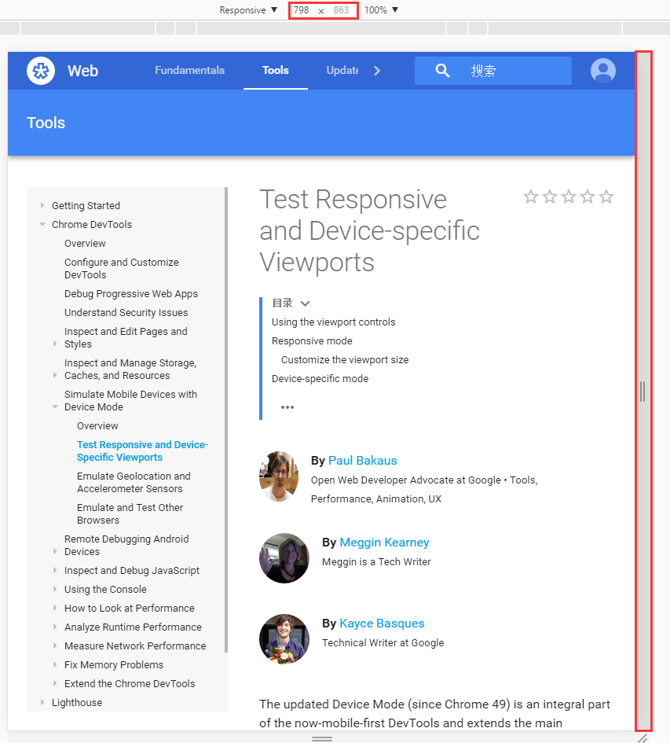

# 设备模式（风格） Device Mode

使用Device Mode 构建全响应式，移动体验优先的web程序，学习如何通过它模仿大部分移动设备及功能</br>
如下所示


## 简言之
+ 通过不同的[分辨率及屏幕大小](https://developers.google.com/web/tools/chrome-devtools/iterate/device-mode/emulate-mobile-viewports)模拟站点的显示效果，包含视网膜屏的展示
+ 通过[CSS的媒体查询](https://developers.google.com/web/tools/chrome-devtools/iterate/device-mode/media-queries)和可视化来构建响应式设计
+ 通过[网络模拟器](https://developers.google.com/web/tools/chrome-devtools/profile/network-performance/network-conditions)进行站点性能的评估,此方法不会影响其他打开的标签页面
+ [模拟设备输入](https://developers.google.com/web/tools/chrome-devtools/iterate/device-mode/device-input-and-sensors)操作，包含触控时间，地理位置和设备旋转状态

## 禁用设备模式

点击按钮进行状态切换，或者使用快捷键```Ctrl``` + ```Shift``` + ```M```

## 控制分辨率及屏幕大小

### 使用视图控制

视图控制允许你通过不同的设备测试站点
+ **响应式** 页面大小可以自由变换进行测试
+ **指定设备** 根据不同设备的屏幕尺寸，锁定当前模拟器的视图大小

#### 响应模式
默认模拟方式，以相对自由的方式模拟各种屏幕尺寸及设备，对后续未来的设备更友好

##### 自定义大小
通过拖动或键入数值的方式


#### 指定模拟设备
指定站点在某个设备上运行

##### 预置设备
包含了当前最为流行的几款设备，选择设备后，每一个预先设定的配置都会自动的加入到设备特征中
+ 中设置正确的'User Agent'
+ 设定设备的分辨率及DPI
+ 模拟触控事件
+ 模拟移动设备滚动凡是及元视图(meta viewport)
+ 未明确给出viewport设置则自动调整字体大小

如图：


##### 添加自定义设备

添加一个自定义设备模拟的步骤如下：
+ 打开DevTools设置面板
+ 选择Devicess面板
+ 点击 Add custom device
+ 键入设备名称、宽度、高度、DPI和UA
+ 点击Add 按钮


#### 设备状态及翻转控制

模拟水平和垂直设备时的站点显示效果,可以同时包含以下一个或多个设备状态
+ 默认UI
+ 显示chrome导航栏
+ 键盘弹出


#### 缩放适配
+ Fit to Window会自动设置屏幕最大可用的缩放比例，默认100%
+ 指定缩放比,通常用于测试图片等在DPI下的显示效果


#### 其他选项控制(touch、media queries, DPR)
+ UA类型（模拟UA及touch事件）
+ DPI
+ 媒体查询
+ 标尺
+ 网络配置（节流）


##### UA类型
+ Mobile
+ Desktop
+ Desktop with touch

如果构建的是桌面级响应式程序，那么应该选择Desktop

##### Device pixel ratio (DPR)
如果想要在非视网膜屏上模拟视网膜屏的显示效果，那么可以通过适配DPR的方式来实现。DPR表示的是逻辑像素与物理像素的比例，一些视网膜屏设备，如Nexus6P,相比于其他设备拥有较高的像素密度，能够让视觉内容显示的更为清晰

网页上对DPR有实现的例子如下：
+ CSS媒体查询</br>
    ```@media (-webkit-min-device-pixel-ratio: 2), (min-resolution: 192dpi) { ... }```
+ CSS```image-set```样式规则
+ image标签的srcset属性
+ ```window.devicePixelRatio```

##### 媒体查询
不同媒体查询的快速预览效果的切换方式

以不同的颜色区分媒体查询
<table>
    <tbody>
        <tr>
            <th style="height: 40px;backgroud-color:blue;width: 60px;"></th>
            <th>最大宽度</th>
        </tr>
        <tr>
            <th style="height: 40px;backgroud-color:green;width: 60px;"></th>
            <th>范围宽度</th>
        </tr>
        <tr>
            <th style="height: 40px;backgroud-color:#d4731f;width: 60px;"></th>
            <th>最小宽度</th>
        </tr>
    </tbody>
</table>

##### 关联样式查看
在媒体查询栏上右击，可以查看当前CSS样式定义


#### 标尺
标尺显示的是viewport中定义的基础的像素规则

#### 配置网络(UA/网络节流)
此配置可以控制网络状况
+ 磁盘缓存 可以禁用磁盘缓存来禁止从磁盘中读取已加载的资源
+ 网络节流 
+ UA 允许自定义

#### 设备模式的一些限制(无法模拟或未实现)
+ 设备硬件
+ GPU和CPU
+ 浏览器UI（不同设备上自带的浏览器是不同的）
+ 系统显示，例如地址栏
+ 原生控件，例如```<select>```元素
+ 一些得到增强的功能，如数字输入框可以打开键盘等
+ 一些浏览器的诸多功能
+ WebGL
+ MathML
+ ios5的旋转缩放bug
+ line-height在某些浏览器上不支持
+ IE
+ AppCache
+ 模拟的UA不能够覆盖AppCache manifest文件中的定义


