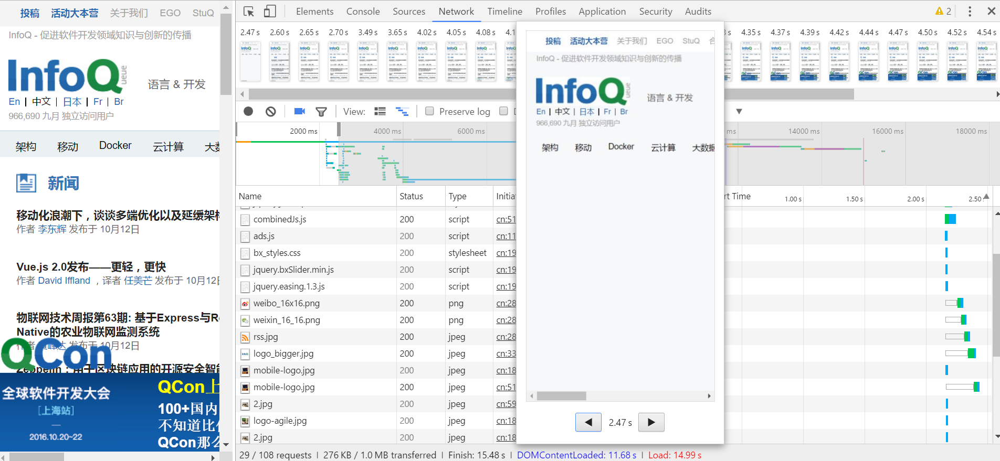
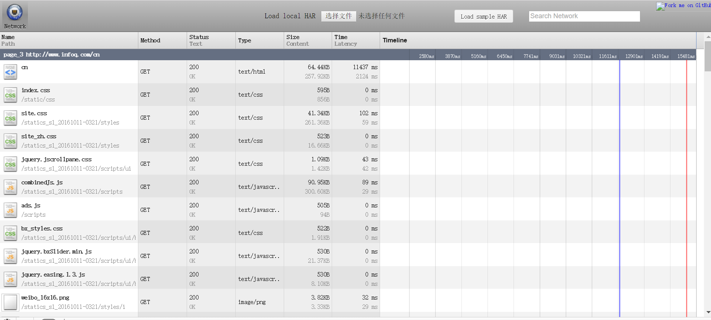

# network
主要显示了network资源加载耗时，测量站点的network性能，具体显示内容包括：HTTP请求及相应头，cookies等 
如下图所示

+ 记录和分析network活动
+ 查看收集到的加载信息和特殊资源
+ 对资源进行过滤和排序显示
+ 保存、复制、清空network记录
+ 按需自定义network面板

network面板分为五个显示区域，各自表示如下：
1. Controls 控制面板的显示和功能
2. Filters  过滤请求列表的显示内容
3. Overview 资源的并发请求
4. Requests Table 详细的显示了资源请求的时间线
5. Summary 显示了资源的请求数量，数据传输大小和加载时间

## Request Table各显示列的含义
+ Name 资源名称
+ Status HTTP状态
+ Type MIME类型
+ Initiator 请求发起者
  * Parser HTML解析
  * Redirect 资源重定向
  * Script 脚本请求
+ Size 从服务器已经接收的资源大小
+ Time 请求时间
+ Timeline 已瀑布流的形式显示各资源的加载时序

## 记录network活动
按钮表示记录network活动，相反为

## 快照
点击按钮，在资源加载过程中显示网页的各时间点的快照,如图

## 查看DOMContentLoaded和load事件信息
如图蓝色的表示DOMContentLoaded加载时间

橙色的表示load加载时间

## 查看资源详细信息
点击一个资源，会显示它的详细信息,四个标签页内容分别表示如下：
+ Headers http请求头
+ Preview JSON、图片和文本预览
+ Response http返回内容
+ Timing 资源在请求阶段的详细时间分布
  * Queuing 队列时间
  * Stalled 挂起时间
  * Request/Response 请求和响应
  * Request sent 发送耗时
  * Waiting (Time to first byte (TTFB)) 等待时间（直到服务第一次返回）
  * Content Download 下载时间

## 过滤请求
通过输入字符以匹配资源请求名称并显示，同时还支持关键字查询，使用方法如下：
+ domain 仅显示指定域名下的资源，搭配通配符(\*)如\*.com匹配所有以.com结尾的域名
+ has-response-header 仅显示包含响应头的请求
+ is 使用is:running查找WebSocket资源
+ larger-than 查找指定大小的资源，值可以为1K, 表示查找大于1K的资源
+ method 根据method查找
+ mime-type 根据资源类型查找
+ scheme 根据协议类型，如scheme:http 或者 scheme:https
+ mixed-content 根据混合内容进行查找，可选值为mixed-content:all、mixed-content:displayed,此部分可以参考https相关内容
+ set-cookie-domain 查找header设置了指定set-cookie名称的资源
+ set-cookie-value 查找header设置了指定set-cookie值的资源
+ status-code 根据http状态码查找

下面的例子根据domain关键字进行查找：

## 复制、保存和清空network信息
+ Copy Response 复制响应内容
+ Copy as cURL 复制并转换为curl命令
+ Copy All as HAR 复制为HAR数据，HAR文件以JSON格式保存并且描述了network的瀑布流，用以导入到第三方绘图工具上
+ Save as HAR with Content 将所有network数据以Base64编码保存为文件
+ Clear Browser Cache 清空缓存
har文件绘制效果如下图：

